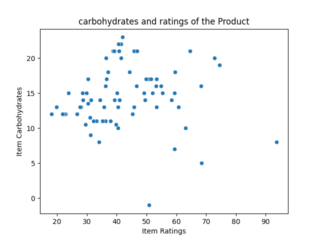
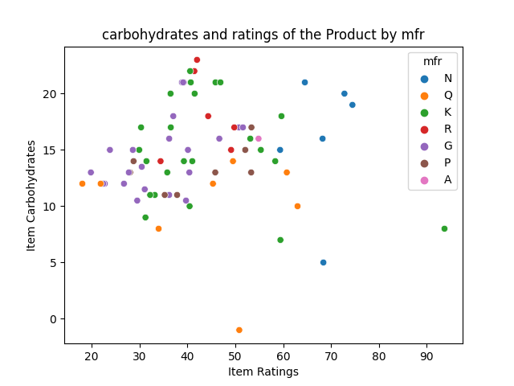

## Descriptive Statistics Using Polar

### Purpose
This code rewrites the last week's assignment in Python Polar. It reads a dataset using Polar, prints summary statistics, and generates analysis plots.

### `src` directory:
1. `polar_script.py` This script defines a function that reads a CSV file using python polar, calculates descriptive statistics for specified or all numeric columns, and prints the results. If the file doesn't exist, it handles the FileNotFoundError.
2. `visualizer.py` It contains the `visualize_polar_data()` function that creates a polar scatter plot of the data, with the points colored according to a categorical variable if specified. The plot is then saved to a folder.

### Test script:
1. `test_main.py` It test cases to help ensure that the descriptive_statistics function behaves as expected when given different inputs, handling both incorrect data paths and valid numeric columns appropriately.

There primary test case passes as shown below: 

### Visualisation: 
1. `plot.py` This script reads a dataset using python polar, creates scatter plots to visualize the relationship between two variables/columns passed by the user, and optionally differentiates data points by color options using a categorical column. It helps users explore and understand the data through these visualizations. The visualisations are saved on `plots` folder
#### Plots insights 
 | 

On average, high-carb items have lower ratings. However, regardless of the carb content, products from manufacturer `N` generally have higher ratings, greater than `50%`.

This means that, while high-carb items are generally rated lower, manufacturer N's products are rated higher than the average high-carb item. This suggests that manufacturer N's products may have other qualities that make them more desirable to consumers, such as better taste, higher quality ingredients, or more convenient packaging.

### Infrastructure scripts:
`.devcontainer`
1. `devcontainer.json` Sets up a development environment. It also includes settings for Docker for VS Code or GitHub Codespace. 
2. `Dockerfile` Dockerfile set up a development environment with Python 3.8

`Makefile` Streamlines development workflows and ensuring code quality and consistency.

`setup.sh` Activates a virtual environment

